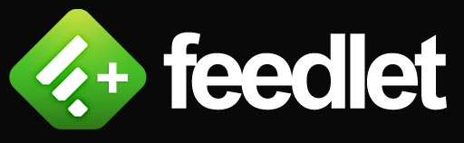

> Important Note: I no longer use Feedly so if errors occur I will not see them, which means if you are using this userstyle and notice an issue please let me know so I can fix it...otherwise I won't ever see it and thus won't be fixed.
>
> To inform me of an error please [submit an issue here on GitHub](https://github.com/MichaelTunnell/feedly-feedlet/issues) or tweet to me [@MichaelTunnell](https://twitter.com/michaeltunnell).

- [Description](#description)
- [Project Details](#details)
- [Installation](#install)
- [Video Demo](#screenshots)

## Feedlet - Universal Subscribing Bookmarklet for Feedly.com

[Feedly](http://feedly.com/) is a great option for a hosted RSS feed service. For those who don't know, Feedly is a cross-platform and cross-browser [RSS Reader](http://youtu.be/0klgLsSxGsU) app. I have used Feedly off and on for years but due to the closure of Google Reader, Feedly has become a vastly more dominant force in the RSS realm. Feedly has a LOT of great features and tools but there was one thing I wanted to be a little bit easier, the process for adding new feeds (subscriptions) to the application. I created this Bookmarklet to solve this problem. This bookmarklet works on all browsers and operating systems (except mobile) that Feedly supports and is ridiculously easy to use.

#### Project Details

Version: 2.0.0

Updated: April 15th, 2013

[Changelog](CHANGELOG.md) | [RSS Feed](https://github.com/MichaelTunnell/feedly-feedlet/commits/master.atom)

---------------

#### Installation & Usage Guide

[Feedlet Button (save this link as a bookmark)](http://javascript:void(window.open('http://www.feedly.com/home#subscription/feed/'+document.location.href));)

`http://javascript:void(window.open('http://www.feedly.com/home#subscription/feed/'+document.location.href));`

Steps to use the Feedlet:

1. Add Feedlet, the Feedly bookmarklet, to you browser. (video demo below)
1. Navigate to the RSS feed that you want to add.
1. Click on the Feedlet bookmark.
1. Click the "+add" button at the top of the page.

-----------

#### Video Demo:

Quick Note: I originally made this bookmarklet in July 2010 so the Feedly interface in the video is not the same as the current interface but the basics of it are the same. I will record a new video if requested but to get this blog post up as soon as possible I elected to use the old one. Also all of the numbers and the name of my company has had some changes so yea...ignore those too.

